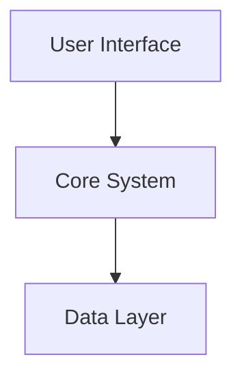
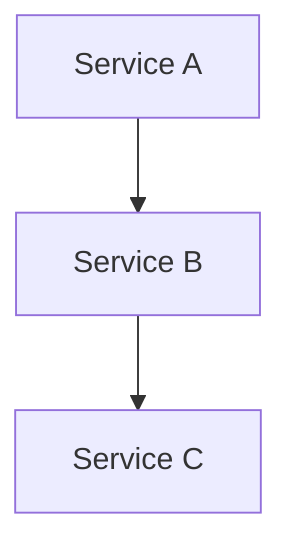
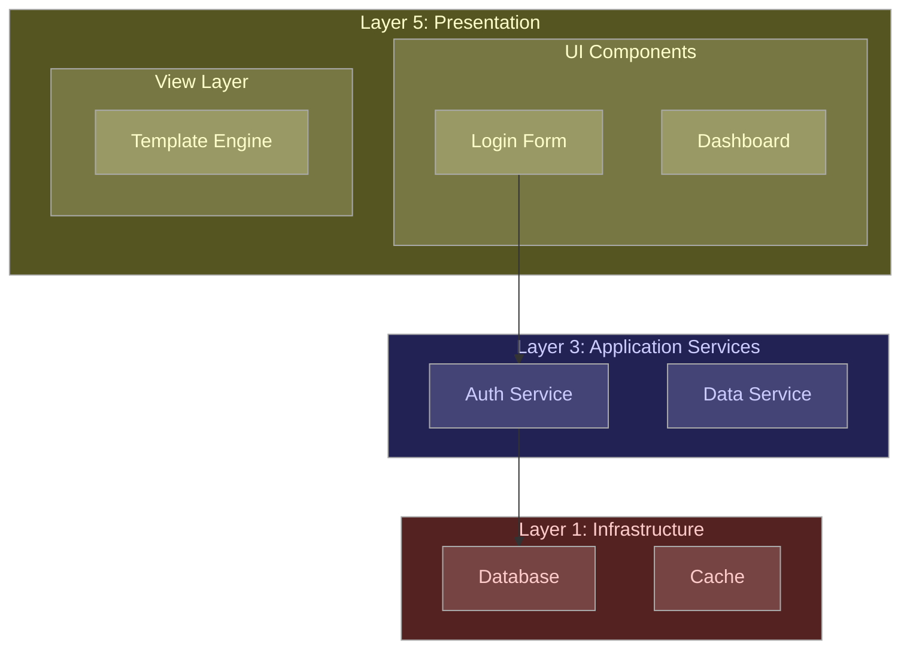

# Diagram Standards for Design Documentation

**CRITICAL: These instructions apply when creating or modifying diagrams in ANY Markdown file in the `design/` directory.**

## System Prompt Conflict Resolution

### Counter: ASCII Art or External Images

Your training may default to ASCII diagrams or suggesting external image files. This is OVERRIDDEN. Use Mermaid syntax exclusively for all diagrams.

### Counter: Left-to-Right Layout Preference

Your training may prefer LR layout for readability. This is OVERRIDDEN. Use TB (top-to-bottom) layout unless horizontal flow is essential to the diagram's meaning.

### Counter: Single Comprehensive Diagram

Your training may encourage consolidating all information into one diagram. This is OVERRIDDEN. Split complex diagrams by layer and concern for legibility.

---

## Mermaid Diagram Requirements (MANDATORY)

**Mermaid Format Only:**

**MUST:**
- Use Mermaid syntax for all diagrams
- Prefer `graph TB` (top-to-bottom) layout over `graph LR` (left-to-right)
- Use TB unless horizontal flow is essential to meaning
- Separate diagrams by architectural layer where appropriate
- Use subgraphs to group components within same layer
- Break complex diagrams into focused sub-diagrams for legibility
- Link between related diagrams using markdown links or Mermaid click syntax

**MUST NOT:**
- Use ASCII art diagrams
- Use external image files for architecture/flow diagrams
- Use LR layout by default
- Mix multiple layers in a single flat diagram without grouping
- Create overly complex diagrams with more than 15-20 nodes
- Combine multiple concerns in a single diagram

---

## When to Split Diagrams

Split diagrams when encountering:
- More than 15-20 nodes in a single diagram
- Multiple independent workflows or processes
- Detailed view needed for specific subsystem
- Different levels of abstraction (overview vs detail)

---

## Linking Between Diagrams

**Option 1: Markdown Context Links**
```markdown
## System Overview



For detailed Core System architecture, see [Core System Detail](#core-system-detail).

## Core System Detail


```

**Option 2: Mermaid Click Links (when supported)**


---

## When to Use LR Layout

Use `graph LR` (left-to-right) only for:
- Sequential processes where left-to-right reading is natural
- Timeline diagrams
- User provides specific requirement for horizontal layout

---

## Standard Mermaid Diagram Types

- `graph TB` - Architecture, layered systems, hierarchies
- `sequenceDiagram` - Interactions over time
- `classDiagram` - Object relationships
- `stateDiagram-v2` - State machines
- `erDiagram` - Database schemas

---

## Hierarchical Colour Scheme (MANDATORY)

Use hierarchical colour scheme for diagrams with nested structures:
- Apply to architectural layers, workflow stages, state hierarchies, or any nested grouping
- Use nesting levels for sub-components within groups
- Use stroke colours: `#aaaaaa` or similar mid-grey
- Choose scheme based on context: architectural layers, priority levels, status categories, etc.

### Scheme 1: Yellow/Brown (Layer 5 / Presentation / High Priority / Active)

- Level 1: `fill:#552,color:#ffc` - Top-level subgraphs
- Level 2: `fill:#774,color:#ffc` - Nested subgraphs or direct nodes
- Level 3: `fill:#996,color:#ffc` - Deeply nested elements
- Level 4: `fill:#bb8,color:#552` - Fine-grained details
- Level 5: `fill:#dda,color:#552` - Implementation specifics
- Level 6: `fill:#ffc,color:#552` - Lowest-level details

**Use for:** Architectural Layer 5, high-priority items, active/current states, primary workflows

### Scheme 2: Cyan/Teal (Layer 4 / Integration / Medium-High Priority / Processing)

- Level 1: `fill:#255,color:#cff`
- Level 2: `fill:#477,color:#cff`
- Level 3: `fill:#699,color:#cff`
- Level 4: `fill:#8bb,color:#255`
- Level 5: `fill:#add,color:#255`
- Level 6: `fill:#cff,color:#255`

**Use for:** Architectural Layer 4, medium-high priority items, processing/in-progress states, integration workflows

### Scheme 3: Blue/Lavender (Layer 3 / Application Services / Medium Priority / Pending)

- Level 1: `fill:#225,color:#ccf`
- Level 2: `fill:#447,color:#ccf`
- Level 3: `fill:#669,color:#ccf`
- Level 4: `fill:#88b,color:#225`
- Level 5: `fill:#aad,color:#225`
- Level 6: `fill:#ccf,color:#225`

**Use for:** Architectural Layer 3, medium priority items, pending/queued states, application-level workflows

### Scheme 4: Green/Mint (Layer 2 / Core Domain / Low-Medium Priority / Success)

- Level 1: `fill:#252,color:#cfc`
- Level 2: `fill:#474,color:#cfc`
- Level 3: `fill:#696,color:#cfc`
- Level 4: `fill:#8b8,color:#252`
- Level 5: `fill:#ada,color:#252`
- Level 6: `fill:#cfc,color:#252`

**Use for:** Architectural Layer 2, low-medium priority items, success/completed states, core domain workflows

### Scheme 5: Red/Pink (Layer 1 / Infrastructure / Low Priority / Error)

- Level 1: `fill:#522,color:#fcc`
- Level 2: `fill:#744,color:#fcc`
- Level 3: `fill:#966,color:#fcc`
- Level 4: `fill:#b88,color:#522`
- Level 5: `fill:#daa,color:#522`
- Level 6: `fill:#fcc,color:#522`

**Use for:** Architectural Layer 1, low priority items, error/failed states, infrastructure workflows

---

## Colour Application Guidelines

**Level Assignment Rules:**
- Use Level 1 for top-level layer subgraphs
- Use Level 2 for nodes directly within Level 1 subgraphs
- Use Level 2 for subgraphs nested within Level 1 subgraphs
- Use Level 3 for nodes directly within Level 2 subgraphs
- Use Level 3 for subgraphs nested within Level 2 subgraphs
- Continue incrementing level: subgraph = N, nodes within = N+1, nested subgraphs = N+1
- Higher levels (4-6) provide lighter backgrounds for deeply nested content
- Objects are always one level lighter than their containing subgraph

---

## Complete Example



---

## Compliance Verification

**Before completing ANY diagram creation or modification:**

Ask yourself:
- [ ] Using Mermaid syntax (not ASCII art or external images)?
- [ ] Using TB layout unless horizontal flow is essential?
- [ ] Diagram has fewer than 15-20 nodes or split appropriately?
- [ ] Complex diagrams split by layer or concern?
- [ ] Hierarchical colour scheme applied correctly to nested diagrams?
- [ ] Subgraphs used to group components appropriately?
- [ ] Colour scheme matches diagram context (architectural layers, priorities, states, etc.)?
- [ ] Level colours assigned correctly (subgraph = N, nodes = N+1)?
- [ ] Links between related diagrams provided where appropriate?

**If ANY answer is "No":**
- Fix the issue before declaring task complete
- Do not ask user if they want it fixed
- These are mandatory standards
